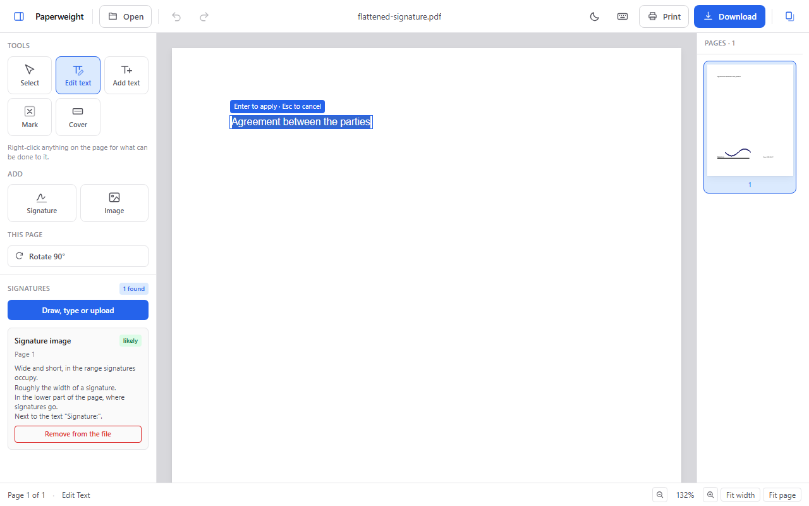
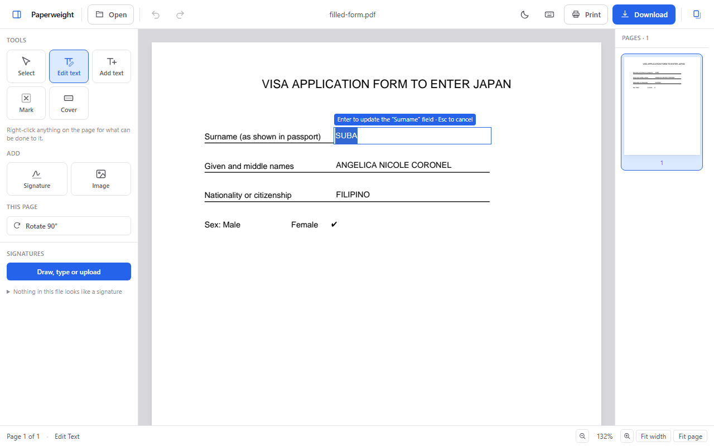
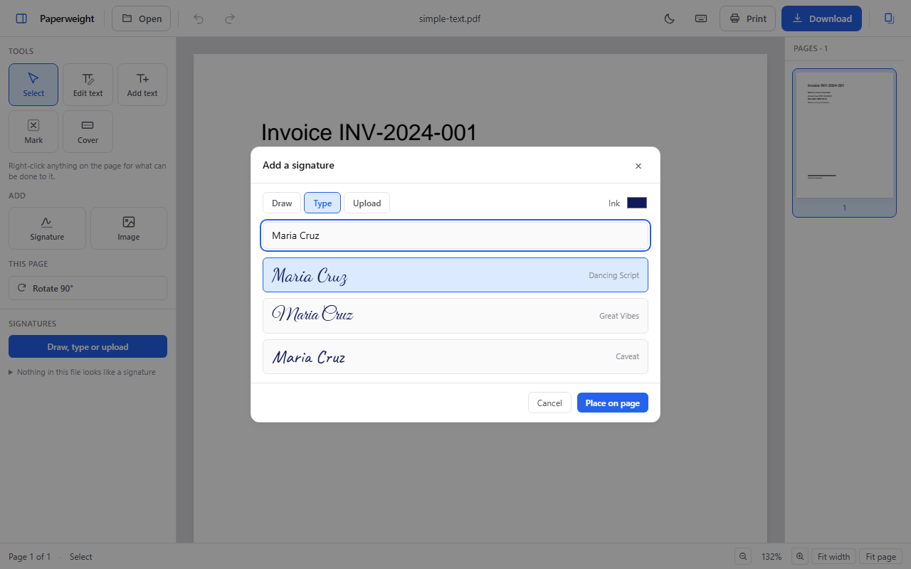
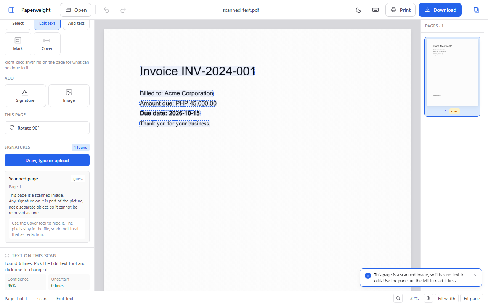
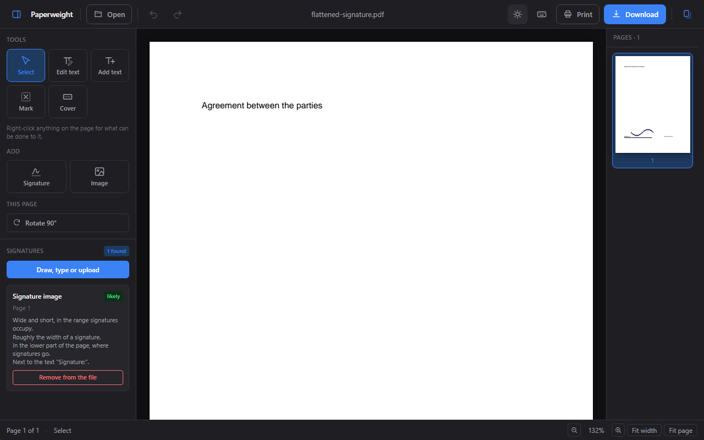
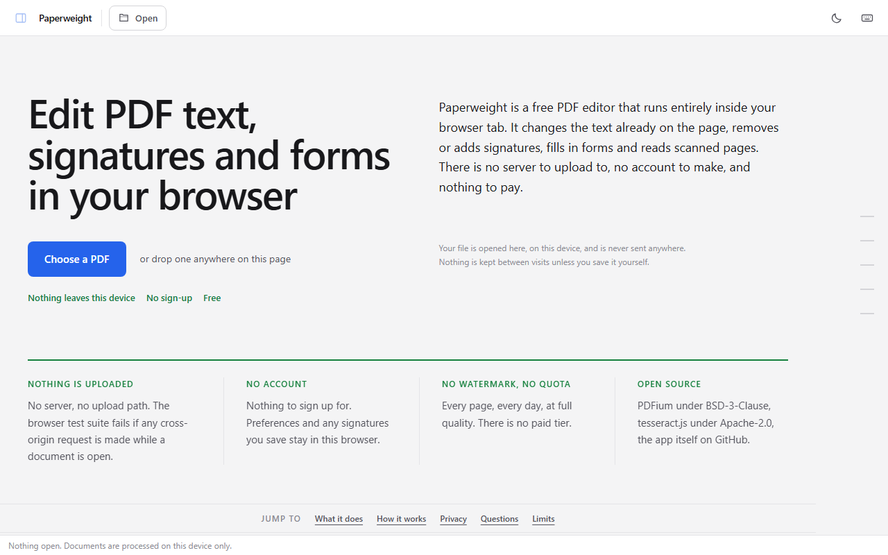

# Paperweight — a free PDF editor that runs in your browser

Paperweight is a free PDF editor that runs entirely inside your browser tab.
It changes the text already on the page, removes or adds signatures, fills in
forms and reads scanned pages. There is no server to upload to, no account to
make, and nothing to pay.

**Try it: <https://paperweight.itskimmatthewbelas.workers.dev>**

Every document stays on your own machine. The PDF engine is PDFium, compiled
to WebAssembly and run in a Web Worker inside the tab, so a file is opened,
edited and saved without ever being uploaded. There is no upload path, no
analytics and no third-party script — and the browser tests fail if a single
cross-origin request is made while a document is open.

**Status:** working. The editing engine is complete and tested; several UI
conveniences are still open. See `TASKS.md`.

## Screenshots

Edit the text that is already in a PDF — click a line and retype it:



Fill in a PDF form. Values are committed through the form itself, so the
printed form matches what other software reads back:



Add a signature by drawing it, typing it in a script face, or uploading a
photo of one:



Read a scanned PDF on-device with OCR, with a confidence score per line:



The editor in its dark theme, and the landing page:





The screenshots are committed files, regenerated with `pnpm shots` after a
build. Every document in them is a fixture from `fixtures/`.

## What it does

- **Edit existing PDF text.** Click a line and retype it. The font the
  document already embeds is reused when it has the glyphs. Embedded fonts are
  usually subsets, so when it does not, a metric-compatible Liberation face is
  substituted and the substitution is reported rather than hidden.
- **Fill in PDF forms.** Type into text fields, tick boxes, choose radio
  options. Values go in through the form itself, so the appearance stream is
  regenerated and the filled form both prints correctly and stays readable to
  other software. A field clips to its own box, so a value too wide for it can
  be widened to fit or drawn as page text, with the trade-off stated.
- **Remove a signature from a PDF.** Annotation signatures, signature form
  fields and signatures flattened into the page are all genuinely removed from
  the file. A signature inside a scanned image cannot be, and the app says so
  instead of drawing a white box and calling it done.
- **Add a signature to a PDF.** Draw, type in a script face, or upload a
  photo. The background is made transparent so it sits on the page rather than
  in a box.
- **Read a scanned PDF.** A scanned page has no text at all. It can be read on
  this device, with a confidence score per line, and a recognised line can be
  replaced by covering it and drawing over it. That is a patch, not an edit,
  and the app says so.
- **Move things.** Select any text or image and drag it.
- **Mark, cover, add text, delete objects, rotate pages, reorder, print and
  save.**

## Deliberate limits

These are stated in the interface, not buried here:

- **Cover is not redaction.** Covering draws an opaque rectangle; the content
  underneath stays in the file and remains extractable. Paperweight does not
  offer redaction and reserves the word for real content removal.
- **Patching a scan is not editing.** Replacing text on a scan paints over the
  original: clean on plain paper, patched on a grey or textured one, never a
  match for the original typeface, and the covered pixels stay in the file.
- **Text edits are line-scoped and never reflow**, because PDF has no
  paragraph model. A longer replacement is condensed, then shrunk, then
  flagged as overflowing.
- **Editing a digitally signed document invalidates the signature.** That is
  the mechanism working as designed; you are told when the document opens.
- **Saving over the original file needs the File System Access API**, so
  outside Chromium the app downloads a copy instead.
- **Reading a scan is English only**, and it is a recognition guess with a
  confidence score, not a transcript.
- **Nested images and shapes cannot be moved**, only nested text.

## Questions

### Is my PDF uploaded anywhere?

No. There is no server behind the page: the editor is a folder of static files
and the PDF engine runs in your browser. Nothing is sent, logged or analysed.
The site refuses connections to any other origin, and the browser tests assert
zero cross-origin requests while a document is open.

### Is it free? Is there a watermark, a quota or an account?

Free, with no account, no watermark, no page limit and no tasks-per-day quota.
There is no paid tier.

### Can it edit the text already in a PDF, and in which font?

Yes. Click a line and retype it. The embedded font is reused when it has the
glyphs; otherwise a metric-compatible Liberation face is substituted and a
badge tells you. Edits are line-scoped, so a longer line is condensed, then
shrunk, rather than reflowed.

### Can it remove a signature? What about digital signatures?

It removes signatures that are annotations, signature form fields or images on
the page, taking them out of the file rather than painting over them. A
signature inside a scanned image cannot be removed, and the app says so. A
digital (cryptographic) signature certifies the exact bytes of the original,
so any edit invalidates it.

### Can it fill in PDF forms?

Yes. Click a field to type, tick a box or pick an option. Values are committed
through the form itself, so the filled form prints correctly and other
software can still read the values.

### Can it edit a scanned PDF?

A scan has no text, only pixels. Paperweight reads a scanned page on this
device (English) with a confidence score per line, and replaces a line by
covering it and drawing new text on top. That is a patch, not an edit.

### Does Cover redact?

No. Cover draws an opaque rectangle over content; the content underneath stays
in the file and can still be extracted.

### Which browsers can save over the original file?

Saving in place uses the File System Access API, which exists in Chromium
browsers such as Chrome, Edge, Brave and Opera. In Firefox and Safari the
button reads Download and produces a copy.

### Does it work offline?

Yes, after the first visit. The page, the interface and the PDF engine are
cached on that first load, so it opens and edits with no network at all, and
it can be installed to a home screen. The substitution fonts and the OCR model
are fetched when first needed and kept from then on.

### What is it built on, and is the source available?

PDFium (BSD-3-Clause) compiled to WebAssembly and run in a Web Worker,
tesseract.js (Apache-2.0) for reading scans, React and Next.js as a static
export. The source is here, under the MIT licence.

The same answers are on the site, where they are also emitted as `FAQPage`
structured data from the same source. `src/site.ts` is that source; a test
compares the two, and another compares these headings to it.

## Browsers

The browser suite runs in Chromium, Firefox and WebKit — every test, in each
engine, against the built site under its real response headers. What differs
between them is written down because the app changes its own behaviour to
match:

|                                           | Chromium | Firefox          | WebKit           |
| ----------------------------------------- | -------- | ---------------- | ---------------- |
| Open, edit, fill forms, read scans, print | yes      | yes              | yes              |
| Save _over_ the original file             | yes      | downloads a copy | downloads a copy |
| Works offline after the first visit       | yes      | yes              | not verified     |

Saving in place needs the File System Access API, which only Chromium
implements. Elsewhere the button reads **Download** and produces a copy, which
is the one difference a user meets — and the interface says which of the two it
is doing rather than implying the original was overwritten.

Edge is not run separately. It is Chromium with the same engine and the same
File System Access API, so it takes the same branch everywhere the code asks a
question about the browser; a third Chromium job would spend minutes
re-proving the first.

WebKit is not Safari. It is the closest engine that can be driven in CI, and it
does test layout, the print path and the download fallback. It does not test
the offline mode: Playwright supports service workers on Chromium-based
browsers only, so the two tests that cut the network skip there. What is still
asserted in WebKit is that the worker installs, takes control and fills both
caches — which it does, identically to Chromium. Confirming the offline path in
Safari proper is a manual pass, and `TASKS.md` tracks it alongside printing.

## Running it

```
pnpm install
pnpm dev          # http://localhost:3000
```

```
pnpm test         # 173 tests: the engine, driving the real PDFium WASM
pnpm test:e2e     # 76 browser tests, in each of the three engines
pnpm typecheck
pnpm format       # prettier; CI fails the whole job without it
pnpm build        # produces out/, a folder of static files
pnpm shots        # regenerate docs/screenshots/ from the built site
```

`pnpm build` emits a plain static site. It can be hosted anywhere, and one of
the browser tests serves it with nothing but a static file server to prove it.

## How it is described to machines

The site is meant to be found and to be summarised correctly by things that
never run it — search crawlers, answer engines and language models. Four files
carry that, and all four are generated from one source so they cannot
contradict each other or the visible page:

| File | What it is |
|---|---|
| `app/sitemap.ts` → `/sitemap.xml` | One URL, with a `lastmod` bumped by hand rather than at build time — a date that is always today is a signal crawlers learn to discount |
| `app/robots.ts` → `/robots.txt` | Nothing disallowed, including the crawlers that feed answer engines, plus a Cloudflare `Content-Signal` |
| `public/llms.txt` | The plain-text brief: what it does, and what it deliberately does not do |
| `src/structured-data.ts` | `SoftwareApplication` and `FAQPage` JSON-LD, built from the same strings the page renders |

`src/site.ts` holds every public string — the headline, the lead paragraph
written to be quotable on its own, the FAQ, the keywords. `tests/e2e/seo.spec.ts`
compares the structured data against the rendered page, because structured
data that contradicts the page is worse than none.

## Deploying

`out/` deploys to Cloudflare Workers as static assets. The Worker is described
in `wrangler.jsonc`. Response headers, including a Content-Security-Policy that
pins the build's inline scripts by hash, come from `out/_headers`, which
`scripts/write-headers.mjs` writes after every build.

```
pnpm test:e2e:deploy   # the browser suite against wrangler dev, headers included
pnpm preview           # serve the last build the way Cloudflare will
pnpm exec wrangler deploy
```

CI (`.github/workflows/ci.yml`) does the same on every push: typecheck, engine
tests, build, browser tests against `wrangler dev`, then `wrangler deploy` of
the tested `out/` on `main`, or a preview URL posted on a pull request. It
needs two repository secrets: `CLOUDFLARE_API_TOKEN`, a token with the
"Workers Scripts: Edit" permission, and `CLOUDFLARE_ACCOUNT_ID`.

## Layout

| Path | What it is |
|---|---|
| `PLAN.md` | The plan: decisions, architecture, roadmap |
| `CLAUDE.md` | Hard rules for working in this codebase |
| `docs/spikes.md` | What the risk-reduction spikes found |
| `docs/research/` | Five research reports, ~250 cited sources |
| `docs/screenshots/` | The images in this file, from `pnpm shots` |
| `src/engine/` | PDFium, in a worker. The only place that touches PDFium |
| `src/editor/` | React UI |
| `src/ocr/` | Reading scans with tesseract.js |
| `src/io/` | Files, printing and local storage |
| `src/offline/` | The service worker and its registration |
| `src/site.ts` | Every public-facing string: landing copy, head, structured data |
| `fixtures/` | Hand-built PDFs pinning the structural edge cases |
| `tests/deploy/` | Browser tests that only make sense with the deployment's headers |
| `wrangler.jsonc` | The Cloudflare deployment, as code |
| `.github/workflows/ci.yml` | Test, build and deploy on every push |

## Licences

Paperweight is MIT licensed; the text is in `LICENSE`. It was chosen to match
what it is built on rather than to make a point: everything below is
permissive, so a licence that was not would be the only obstacle in the stack.

PDFium is BSD-3-Clause and its wrapper `@embedpdf/pdfium` is MIT. tesseract.js
and its OCR core are Apache-2.0. The bundled fonts (Liberation, Dancing
Script, Great Vibes, Caveat) are SIL OFL 1.1, with their licence files in
`public/fonts/`. No AGPL dependencies, which is why PDFium is used rather than
MuPDF.

Both engines would fetch assets from a CDN by default. All of them — the PDF
WASM, the OCR worker, its core and its language model — are served from
`public/`, so the app works offline and makes no outbound requests. Three
browser tests hold that in place.
